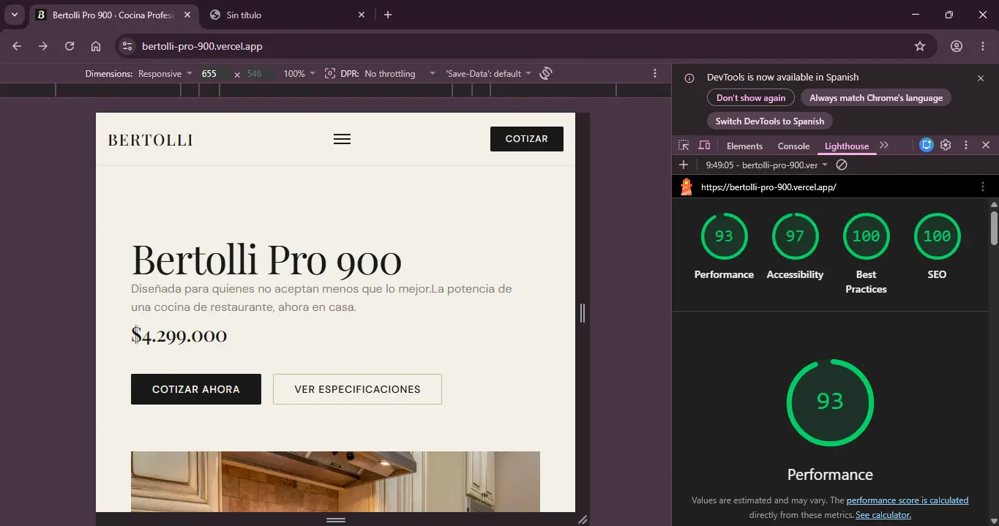

# Bertolli Pro 900

Este proyecto es una landing page de producto para una cocina a gas profesional ficticia de 5 hornillas. Lo desarrollé como prueba técnica frontend donde el reto era construir algo visualmente premium usando solo HTML, CSS y JavaScript vanilla — sin frameworks, sin librerías, sin atajos.

La página está pensada para una persona que está investigando antes de comprar: alguien que quiere ver el producto, entender sus características, resolver sus dudas y finalmente cotizar.

🔗 [Demo en vivo](https://bertolli-pro-900.vercel.app)

## Decisiones de diseño

### Paleta de colores
Quería que la página se sintiera cara antes de que alguien leyera el precio. Por eso descarté el blanco puro y el negro absoluto desde el principio — esos son los colores de cualquier tienda genérica. En cambio elegí un crema #f5f0e8 y un negro carbón #1a1a18 que tienen una temperatura más cálida, más cercana a materiales físicos como papel de calidad o metal.
El dorado #c8b99a lo usé con cuidado: solo en precios, bordes activos y detalles de hover. Si lo pones en todos lados pierde el efecto. Reservarlo para los momentos importantes le da peso real.
La referencia directa fue Smeg y KitchenAid — fondos claros, tipografía oscura, un solo acento de color y mucho espacio en blanco.

### Tipografía
Playfair Display para los títulos porque es una serif con mucho contraste entre trazos finos y gruesos — visualmente transmite precisión y calidad. La reservé solo para encabezados porque en bloques largos se cansa.
DM Sans para el cuerpo porque es limpia, legible en pantalla y no compite con Playfair. El contraste entre las dos es lo que le da personalidad a la página.
Los tamaños usan clamp() para que escalen suavemente entre móvil y desktop sin saltos bruscos.

### Espaciado
El espacio en blanco fue una decisión consciente. Las marcas premium respiran — no amontonan contenido. Si la página se siente apretada, se siente barata.
En desktop tuve que corregir a mano el padding del contenedor en 1024px porque el valor inicial era demasiado generoso y el contenido se veía perdido. Lo ajusté hasta que se sintió anclado pero con aire.

## Cómo verlo localmente

1. Clona el repositorio con git clone https://github.com/AnyelyHuelgos/bertolli-pro-900.git
2. Abre la carpeta en VS Code (cd bertolli-pro-900)
3. Click derecho en `index.html` → Open with Live Server
4. Se abre solo en el navegador en `localhost:5500`

No necesita instalación ni dependencias.

## MI FLUJO CON IA

### ¿Qué partes delegué a Claude y por qué?
Le delegué todo lo que era contenido y texto de la página — descripciones de características, preguntas del FAQ, copy del hero — porque no tenía sentido invertir tiempo en inventar textos de un producto ficticio cuando ese no era el foco de la prueba.
En CSS le pedí que generara las variables de diseño como punto de partida, el reset y los estilos base de la página. También le pedí ayuda cuando me bloqueé con la galería: tenía el abrir y cerrar del lightbox pero no sabía cómo pasar la imagen correcta ni manejar la navegación entre fotos, así que le mostré lo que llevaba y me ayudó a completarlo. Para las especificaciones técnicas le pedí tres ideas visuales primero, elegí la que más me gustó y luego le pedí el código. La calculadora de cuotas y la validación del formulario las delegué porque quería que funcionaran con precisión — son los puntos donde el usuario toma una decisión real, y no podía permitirme errores ahí.
En JavaScript tuve un rol mixto: yo escribía el código base y Claude me ayudaba a mejorarlo o completarlo. El menú hamburguesa, la galería y el formulario los empecé yo y los refinamos juntos.
Al final me ayudó con el proceso de subir el proyecto a Vercel y con la optimización de imágenes para mejorar el score de Lighthouse — cosas puntuales donde era más eficiente preguntarle directamente que buscar en documentación.

### ¿Qué partes hice a mano sin IA y por qué?
Las secciones de inicio, características y especificaciones las escribí yo en HTML desde cero — la estructura, la jerarquía y los nombres de clases. Claude me ayudó después a corregir detalles puntuales en otras partes, pero estas tres las construí sola porque quería tener control total sobre el núcleo del contenido.
En CSS diseñé a mano el layout del hero, el grid de características y los estilos del formulario de contacto. El grid de características lo pensé yo — una columna en móvil, dos en tablet, tres en desktop — y también decidí el hover con desplazamiento vertical y el borde dorado como acento. Son decisiones de diseño que requieren criterio visual, no solo código.
El acordeón del FAQ lo escribí completamente a mano porque es lógica simple y directa: busca los botones, escucha el click, lee el aria-expanded, cierra los demás y abre o cierra el actual. Quería tener al menos una función JavaScript que pudiera defender línea por línea sin dudar.

### ¿Hubo alguna sugerencia de Claude que rechacé?
Sí, dos veces. La primera fue con las variables CSS — Claude generó un sistema demasiado extenso y yo quería algo manejable y claro, así que lo reduje a máximo 23 variables con solo lo necesario. Un sistema de tokens gigante para un proyecto de esta escala es complejo de manejar.
La segunda fue con el footer. Le pedí consejo estético y me propuso algo muy recargado que no encajaba con la línea limpia y premium del resto de la página. Tomé solo las sugerencias que tenían sentido y descarté el resto. El criterio de diseño era mío, Claude era una opinión más.

### ¿Cuál fue el error más grande que cometió la IA?
El error más notable fue con la galería. Claude generó el lightbox pero al verlo en el servidor el resultado fue horrible: el botón de cerrar no funcionaba, la imagen grande quedaba perdida con fondo negro en la parte de abajo, y las imágenes tenían tamaños inconsistentes entre sí. Funcionalmente estaba roto y estéticamente era un desastre.
Lo detecté al desplegarlo y verlo en el navegador — en papel el código parecía correcto, pero en la práctica no funcionaba. Tuve que volver a Claude, mostrarle exactamente lo que estaba pasando y trabajarlo de nuevo hasta que quedó bien. Aprendí que con la IA no basta con que el código "tenga sentido" — hay que probarlo siempre en condiciones reales.

### Si tuviera que rehacer esta prueba mañana, ¿qué haría diferente?
Le pediría opciones antes del código en más secciones. Lo hice con las especificaciones técnicas — pedí tres ideas visuales, elegí la que más me gustó y luego pedí el código — y fue el flujo que mejor me funcionó en todo el proyecto. Si lo repitiera, aplicaría esa misma lógica desde el principio en cada sección: primero criterio, luego ejecución.

## DECISIONES TECNICAS

La calculadora de cuotas fue construida con Claude. Reconozco que los estilos quedaron con valores hardcodeados en lugar de usar las variables del sistema de tokens — es una deuda técnica que identifico y que resolvería migrando cada valor a tokens.css.

### HTML semántico
Usé las etiquetas correctas según el contenido: header, main, section, article, nav y footer. Las tarjetas de características usan article porque cada una es una pieza de contenido independiente. El visor de la galería tiene role="dialog" y aria-modal="true" porque se comporta como un modal. La tabla de especificaciones tiene scope="row" en cada encabezado para que los lectores de pantalla entiendan la relación entre celda y valor.
Agregué aria-label en todas las secciones, aria-expanded y aria-controls en el FAQ y el menú, aria-hidden en los íconos decorativos, y aria-live="polite" en los mensajes de error del formulario para que se anuncien cuando aparecen.

### Grid vs Flexbox
La regla general fue simple: Grid para layouts bidimensionales, Flexbox para alinear elementos en una sola dirección.
El hero y el grid de características usan Grid porque manejan filas y columnas al mismo tiempo. La navegación y el formulario usan Flexbox porque son estructuras lineales — una fila o una columna. El footer usa Grid para las cuatro columnas principales y Flexbox dentro de cada columna para los elementos internos.
Tipografía fluida con clamp()
En vez de redefinir tamaños en cada breakpoint, usé clamp() para que los títulos y textos escalen suavemente entre móvil y desktop.

### JavaScript
Toda la lógica está envuelta en DOMContentLoaded para que no bloquee la carga de la página. La galería, el FAQ y el formulario se inicializan con IntersectionObserver — solo cargan su lógica cuando la sección entra en el viewport, lo que mejora el rendimiento general.
El menú hamburguesa maneja el foco correctamente: al cerrar con Escape, el foco vuelve al botón de toggle. La galería también devuelve el foco a la foto que abrió el visor al cerrar. Estas decisiones son pequeñas pero marcan la diferencia en accesibilidad por teclado.
Mobile-first
Todos los estilos base están escritos para móvil. Los @media (min-width) agregan complejidad progresivamente. Es más fácil de mantener y los dispositivos pequeños no cargan estilos que luego se sobreescriben.

## QUE MEJORARIA SI TUVIERA MAS TIEMPO

Le daría más atención a las animaciones — me gustaría agregar entradas suaves a los elementos al hacer scroll con IntersectionObserver.
En el lado técnico, implementaría dark mode con toggle y persistencia en localStorage para que la preferencia se guarde entre visitas.
En funcionalidad, conectaría el formulario a un servicio real como Formspree para que los mensajes lleguen de verdad, y agregaría una sección de testimonios y un comparador de modelos — dos cosas que aportarían mucho al usuario que está investigando antes de comprar.

## TEST BASICOS MANUALES

Menú hamburguesa abre y cierra en móvil✅
Galería navega con teclado (flechas y Escape)✅
FAQ abre y cierra correctamente✅
Formulario valida campos vacíos y email inválido✅
Calculadora actualiza el valor al cambiar cuotas✅
Página responsive en 320px, 768px y 1200px✅
Lighthouse ≥ 90 en performance✅

## Lighthouse

- Performance: 93
- Accessibility: 97
- Best Practices: 100
- SEO: 100

